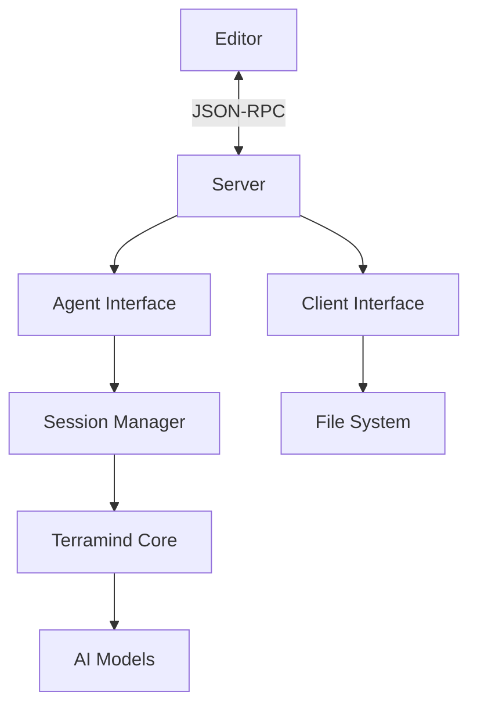

## Overview

Terramind implements the [Agent Client Protocol (ACP)](https://agentclientprotocol.com/) specification v1, providing a clean, protocol-compliant interface for editor integration.

## Architecture Components

The implementation follows a clean separation of concerns:



### Core Components

#### Server (`server.ts`)

The ACP server manages lifecycle and I/O:

- Sets up JSON-RPC over stdio using official ACP library
- Manages graceful shutdown on SIGTERM/SIGINT
- Provides instance context for the agent
- Handles process-level concerns

```typescript
// Start the ACP server
await ACPServer.start()
```

#### Agent Interface (`agent.ts`)

Implements the `Agent` interface from `@agentclientprotocol/sdk`:

- **Initialization**: Handles protocol version negotiation
- **Session lifecycle**: Creates and loads sessions
- **Prompt processing**: Processes user prompts and returns responses
- **Capability advertisement**: Declares what the agent can do

**Key methods:**
- `initialize()` - Protocol handshake
- `session/new` - Create new conversation
- `session/load` - Resume existing session
- `session/prompt` - Process user input

#### Client Interface (`client.ts`)

Implements the `Client` interface for client-side capabilities:

- **File operations**: Read and write files
- **Permission requests**: Request user approval for actions
- **Terminal support**: Execute terminal commands (stub)

**Key methods:**
- `readTextFile()` - Read file contents
- `writeTextFile()` - Write file contents
- `requestPermissions()` - Ask for user approval

#### Session Manager (`session.ts`)

Manages session state:

- Creates and tracks ACP sessions
- Maps ACP sessions to internal Terramind sessions
- Maintains working directory context
- Handles MCP server configurations

```typescript
// Create a new session
const session = await ACPSession.create({
  cwd: "/path/to/project",
  mcpServers: [],
})
```

---

## Protocol Flow

### 1. Initialization

```json
// Request from editor
{
  "jsonrpc": "2.0",
  "id": 1,
  "method": "initialize",
  "params": {
    "protocolVersion": 1,
    "clientInfo": {
      "name": "Zed",
      "version": "0.1.0"
    }
  }
}

// Response from Terramind
{
  "jsonrpc": "2.0",
  "id": 1,
  "result": {
    "protocolVersion": 1,
    "agentCapabilities": {
      "supportsStreaming": false,
      "supportsTools": true,
      "supportsSessions": true
    },
    "agentInfo": {
      "name": "Terramind",
      "version": "0.0.8"
    }
  }
}
```

### 2. Create Session

```json
// Request
{
  "jsonrpc": "2.0",
  "id": 2,
  "method": "session/new",
  "params": {
    "cwd": "/path/to/project",
    "mcpServers": []
  }
}

// Response
{
  "jsonrpc": "2.0",
  "id": 2,
  "result": {
    "sessionId": "01JBCDEF12345678",
    "mode": "code"
  }
}
```

### 3. Send Prompt

```json
// Request
{
  "jsonrpc": "2.0",
  "id": 3,
  "method": "session/prompt",
  "params": {
    "sessionId": "01JBCDEF12345678",
    "prompt": {
      "contents": [
        {
          "type": "text",
          "text": "Refactor this function to use async/await"
        }
      ]
    }
  }
}

// Response
{
  "jsonrpc": "2.0",
  "id": 3,
  "result": {
    "response": {
      "contents": [
        {
          "type": "text",
          "text": "Here's the refactored function..."
        }
      ],
      "stopReason": "endTurn"
    }
  }
}
```

---

## Implementation Details

### Why the Official Library?

Terramind uses `@agentclientprotocol/sdk` instead of implementing JSON-RPC manually because:

- **Ensures protocol compliance** with ACP specification
- **Handles edge cases** and future protocol versions
- **Reduces maintenance burden** significantly
- **Works with other ACP clients** automatically

### Mapping to Terramind Core

ACP sessions map cleanly to Terramind's internal model:

| ACP Concept | Terramind Implementation |
|-------------|-------------------------|
| `session/new` | Creates internal `Session` |
| `session/prompt` | Uses `SessionPrompt.prompt()` |
| Working directory | Preserved per-session |
| Tool execution | Uses existing `ToolRegistry` |

### Tool Integration

ACP tool calls are mapped to Terramind's tool system:

```typescript
// Terramind tools available via ACP:
- bash      // Execute shell commands
- read      // Read file contents
- write     // Write/modify files
- grep      // Search file contents
- codesearch // Semantic code search
- glob      // File pattern matching
- ls        // List directory contents
```

---

## Current Capabilities

### ✅ Fully Implemented

- **Protocol v1 compliance**
- **Session management** (create, load)
- **Prompt processing** with AI responses
- **File operations** (read, write)
- **Tool execution** via Terramind's tool registry
- **Working directory context**
- **Permission requests**
- **MCP server configuration**

### ⚠️ Partial Implementation

- **Session loading** - Basic support, doesn't restore full history
- **Terminal support** - Placeholder implementation
- **Authentication** - Stub only

### ❌ Not Yet Implemented

- **Streaming responses** - Currently returns complete responses
- **Tool call reporting** - Doesn't report tool execution progress
- **Session modes** - No mode switching support
- **Real-time updates** - No `session/update` notifications

---

## Future Enhancements

### Planned Features

1. **Real-time Streaming**

Implement `session/update` notifications for progressive responses:

```json
{
  "jsonrpc": "2.0",
  "method": "session/update",
  "params": {
    "sessionId": "01JBCDEF12345678",
    "update": {
      "type": "content",
      "content": "Here's the first part..."
    }
  }
}
```

2. **Tool Call Visibility**

Report tool executions as they happen:

```json
{
  "jsonrpc": "2.0",
  "method": "session/update",
  "params": {
    "sessionId": "01JBCDEF12345678",
    "update": {
      "type": "toolCall",
      "toolName": "read",
      "args": {"file": "src/app.ts"}
    }
  }
}
```

3. **Session Persistence**

Save and restore full conversation history:
- Store messages in session storage
- Load complete context on `session/load`
- Support conversation branching

4. **Mode Support**

Implement different operational modes:
- `ask` - Question answering only
- `code` - Full code editing (default)
- `review` - Code review mode

5. **Enhanced Permissions**

More sophisticated permission handling:
- Granular file permissions
- Command whitelist/blacklist
- Automatic approval for safe operations

---

## Performance Considerations

### Efficient Context Loading

Terramind optimizes context loading:

- **Lazy file reading** - Only reads files when needed
- **Smart caching** - Caches frequently accessed files
- **Incremental updates** - Only processes changed files
- **Ignore patterns** - Respects `.gitignore` to skip unnecessary files

### Memory Management

Sessions are managed efficiently:

- **Bounded history** - Limits conversation history size
- **Automatic cleanup** - Removes old sessions
- **Context pruning** - Removes irrelevant context
- **Streaming support** (planned) - Reduces memory footprint

### Network Optimization

Minimize API calls:

- **Batched requests** - Combines multiple operations
- **Smart retries** - Exponential backoff on failures
- **Request caching** - Caches appropriate responses
- **Model selection** - Uses appropriate model for task

---

## Security

### Sandboxing

File operations are sandboxed:

- **Permission checks** before modifications
- **Path validation** to prevent directory traversal
- **Gitignore respect** to avoid sensitive files
- **Command restrictions** for bash tool

### Authentication

Authentication flows (to be enhanced):

- **API key validation**
- **Firebase token support**
- **Session-based auth**
- **Rate limiting**

### Audit Logging

All operations are logged:

- **File accesses** recorded
- **Tool executions** logged
- **Permission requests** tracked
- **Errors** captured

---

## Testing

### Unit Tests

Test individual components:

```bash
bun test test/acp.test.ts
```

### Integration Tests

Test protocol compliance:

```bash
echo '{"jsonrpc":"2.0","id":1,"method":"initialize","params":{"protocolVersion":1}}' | terramind acp
```

### Editor Testing

Test with real editor integration:

1. Configure editor with ACP
2. Start Terramind ACP server
3. Send test prompts
4. Verify responses and file operations

---

## Debugging

### Enable Debug Mode

Run with debug logging:

```bash
terramind acp --debug
```

Or set environment variable:

```bash
export TERRAMIND_LOG_LEVEL=debug
terramind acp
```

### View Logs

Check application logs:

```bash
terramind debug logs
```

### Protocol Inspection

Monitor JSON-RPC messages:

```bash
# Use a JSON-RPC inspector
terramind acp 2>&1 | jq .
```

---

## Contributing

To contribute to ACP implementation:

1. **Read the spec**: [agentclientprotocol.com](https://agentclientprotocol.com/)
2. **Check issues**: Look for ACP-related issues
3. **Follow patterns**: Use existing component structure
4. **Add tests**: Include unit and integration tests
5. **Update docs**: Document new capabilities

---

## References

- [ACP Specification](https://agentclientprotocol.com/)
- [TypeScript SDK](https://github.com/agentclientprotocol/typescript-sdk)
- [Terramind GitHub](https://github.com/terramind-com)
- [Zed Editor](https://zed.dev/)

---

## Next Steps

<CardGroup cols={2}>
  <Card title="Integration Guide" icon="plug" href="/acp/integration">
    Set up Terramind with your editor
  </Card>
  <Card title="CLI Commands" icon="terminal" href="/cli/commands">
    Learn about CLI usage
  </Card>
</CardGroup>

