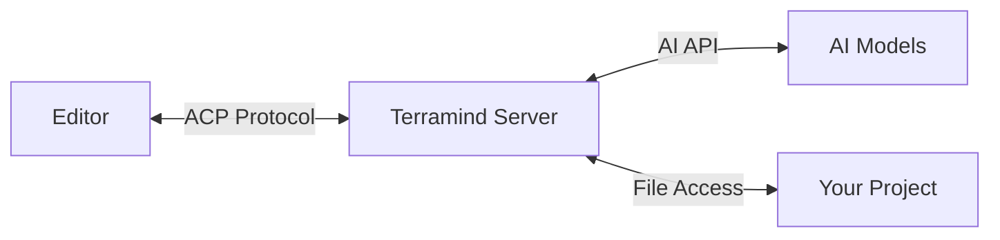

## What is ACP?

The [Agent Client Protocol (ACP)](https://agentclientprotocol.com/) is a standardized protocol for communication between AI agents and client applications like code editors. Terramind implements ACP to provide seamless integration with editors like Zed and other development tools.

## Why Use ACP?

<CardGroup cols={2}>
  <Card title="Editor Integration" icon="code">
    Use Terramind directly in your favorite editor without switching contexts
  </Card>
  <Card title="Standardized Protocol" icon="check">
    Works with any editor that supports ACP - no custom integration needed
  </Card>
  <Card title="Real-time Collaboration" icon="bolt">
    Get AI assistance in real-time as you code
  </Card>
  <Card title="File Context" icon="file">
    Terramind understands your project structure and file contents
  </Card>
</CardGroup>

## How It Works



1. Your editor connects to Terramind via ACP
2. You send prompts through the editor
3. Terramind processes requests with full project context
4. Results are displayed in your editor

## Quick Start

Start the ACP server:

```bash
terramind acp
```

Or in a specific directory:

```bash
terramind acp --cwd /path/to/your/project
```

## Key Features

### Session Management

ACP maintains conversation sessions:

- **Create new sessions** for different tasks
- **Load existing sessions** to continue conversations
- **Preserve context** across requests
- **Working directory** awareness per session

### File Operations

Terramind can interact with your project files:

- **Read files** to understand code context
- **Write files** to make changes
- **Permission requests** for safe operations
- **Respects `.gitignore`** and other ignore patterns

### Tool Execution

Execute tools within the editor context:

- **Code search** to find relevant files
- **Bash commands** for project operations
- **File manipulation** with your permission
- **LSP integration** for code intelligence

## Protocol Compliance

Terramind implements ACP v1 specification:

✅ **Initialization**
- Protocol version negotiation
- Capability advertisement
- Authentication support

✅ **Session Management**
- `session/new` - Create conversations
- `session/load` - Resume sessions
- Working directory context
- MCP server configuration

✅ **Prompting**
- `session/prompt` - Process messages
- Content block handling
- Response with stop reasons

✅ **Client Capabilities**
- File read/write operations
- Permission requests
- Terminal support

## Use Cases

### In-Editor AI Assistance

Get AI help without leaving your editor:

```
You: "Refactor this function to use async/await"
Terramind: [Analyzes code, suggests refactored version]
```

### Project-Wide Understanding

Terramind understands your entire project:

```
You: "Where is the user authentication logic?"
Terramind: [Searches project, finds relevant files]
```

### Code Generation

Generate code with full context:

```
You: "Create a new API endpoint for user profiles"
Terramind: [Creates file with proper imports, follows project patterns]
```

### Debugging

Debug issues with project awareness:

```
You: "This test is failing, can you fix it?"
Terramind: [Reads test file, analyzes error, suggests fix]
```

## Supported Editors

### Zed

Zed has native ACP support. See the [Integration guide](/acp/integration) for setup instructions.

### Other Editors

Any editor implementing the ACP protocol can connect to Terramind. Check your editor's documentation for ACP support.

## Architecture

Terramind's ACP implementation consists of:

- **Agent Interface** - Implements ACP protocol specification
- **Client Interface** - Handles file operations and permissions
- **Session Manager** - Tracks conversation state
- **Server Lifecycle** - Manages JSON-RPC over stdio

Learn more in the [Architecture guide](/acp/architecture).

## Security

ACP operations are safe by default:

- **Permission requests** before file modifications
- **Sandboxed execution** for bash commands
- **Configurable restrictions** for sensitive operations
- **Audit logging** of all actions

## Performance

ACP is designed for responsiveness:

- **Streaming responses** for real-time feedback
- **Efficient context loading** from project files
- **Caching** for repeated operations
- **Minimal overhead** on editor performance

## Limitations

Current limitations (future enhancements planned):

- **Streaming** - Currently returns complete responses
- **Tool visibility** - Doesn't report tool execution progress
- **Session persistence** - Limited conversation history restoration
- **Mode support** - No mode switching yet

See the [Architecture guide](/acp/architecture) for details.

## Next Steps

<CardGroup cols={2}>
  <Card title="Integration Guide" icon="plug" href="/acp/integration">
    Set up Terramind with your editor
  </Card>
  <Card title="Architecture Details" icon="diagram-project" href="/acp/architecture">
    Learn about the technical implementation
  </Card>
</CardGroup>

